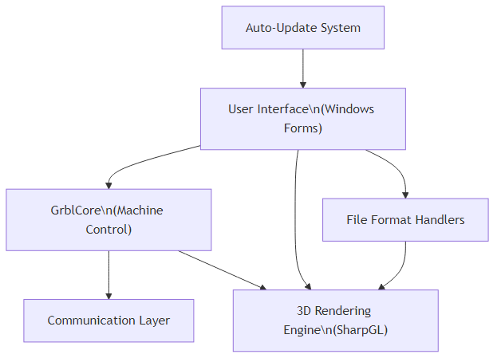
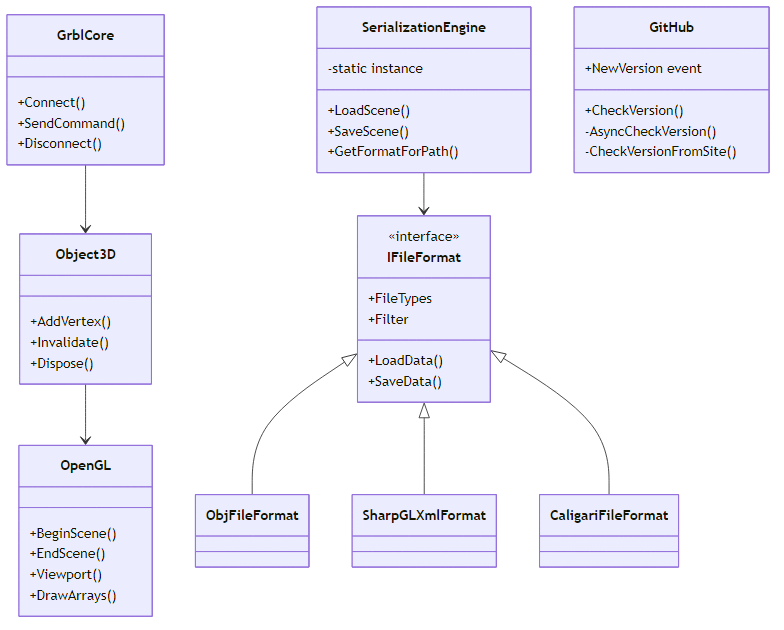
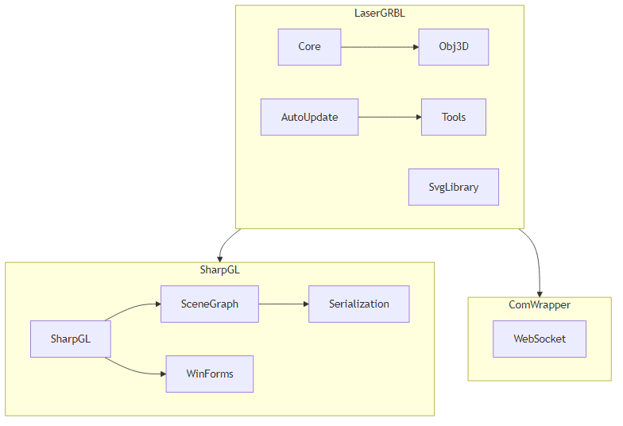
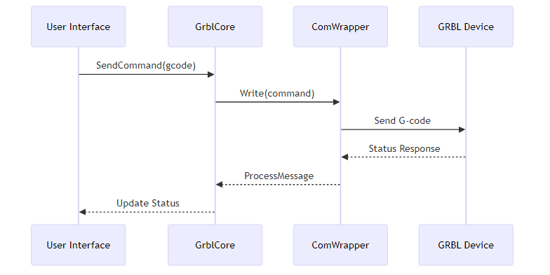
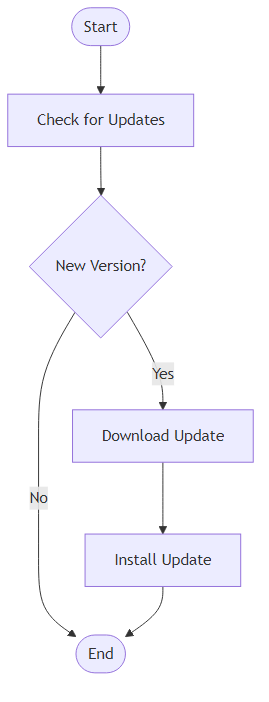

# LaserGRBL Software Architecture

## Overview

LaserGRBL is a Windows application designed for controlling laser engravers and CNC machines that use the GRBL firmware. It's a C# .NET application that provides functionality for:

1. Communicating with GRBL-based devices
2. Visualizing and manipulating 3D objects
3. Converting images to G-code for laser engraving
4. Managing machine operations and configurations
5. Handling automatic updates

## Core Architecture Components

### 1. Core Communication Layer

The application is built around a core communication module that handles interaction with the hardware:

- `GrblCore` class manages the connection to and communication with laser/CNC devices
- Support for different firmware types (Grbl, Smoothie, Marlin, VigoWork)
- Communication happens through wrapper classes in the `ComWrapper` namespace

### 2. 3D Visualization Engine

The application leverages SharpGL (an OpenGL wrapper for .NET) for 3D visualization:

- `Object3D` and related classes in the `Obj3D` namespace
- Rendering capabilities through the OpenGL API
- Scene management with classes like `Scene`, `SceneElement`, `Vertex`, etc.

### 3. File Format Support

The application can import/export various file formats:

- SVG parsing and rendering via the SVG library
- Wavefront OBJ file format support through `ObjFileFormat`
- SharpGL XML format
- Caligari file format support
- Custom serialization through `SerializationEngine`

### 4. Auto-Update Mechanism

An auto-update system that checks for new versions:

- `GitHub` class that checks for updates from GitHub repositories
- Version comparison logic
- Download and installation capabilities

### 5. UI Layer

While not extensively visible in the provided code, the application likely has a Windows Forms UI layer:

- `OpenGLControl` for rendering
- Design-time support via custom designers

## Architectural Patterns

1. **Singleton Pattern**: Used in `SerializationEngine` to ensure a single instance
2. **Factory Pattern**: Present in file format handling
3. **Strategy Pattern**: Used for different firmware types and communication methods
4. **Event-based Communication**: Used for update notifications

## Diagrams

### Component Diagram

*See component-diagram.mmd for source*

### Class Diagram (Core Components)

*See class-diagram.mmd for source*

### Package Structure

*See package-structure.mmd for source*

### Communication Workflow

*See communication-workflow.mmd for source*

### Update Process Flow

*See update-process-flow.mmd for source*

## Key Insights and Architecture Analysis

1. **Modular Design**: The codebase demonstrates a modular approach with clear separation between core functionality components.

2. **Extensibility**: The file format system is designed to be extensible, allowing new format handlers to be added.

3. **Cross-cutting Concerns**: Utilities like logging, serialization, and OS-specific functionality are centralized in the Tools namespace.

4. **Graphics Pipeline**: Heavy use of OpenGL through SharpGL provides sophisticated rendering capabilities.

5. **License Compliance**: The code is licensed under GNU GPLv3, which is reflected in the LICENSE.md file included in the project.

6. **Version Management**: The application is currently at version 7.14.1